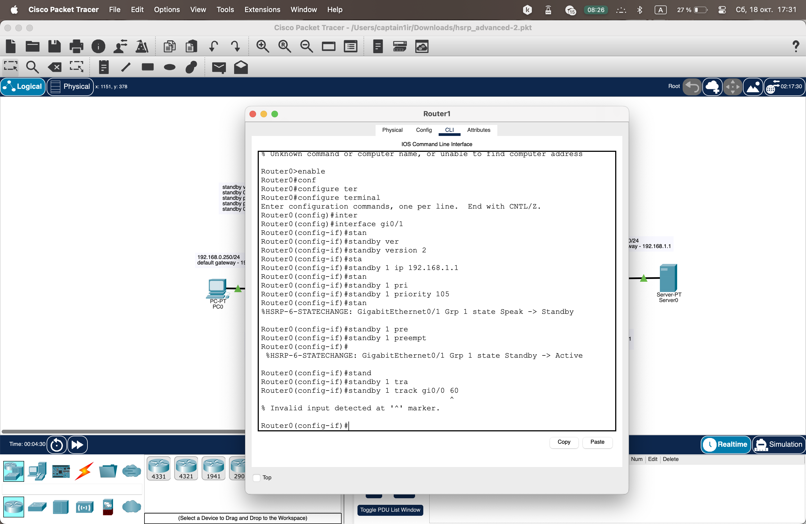

# Домашнее задание к занятию "Disaster Recovery. FHRP и Keepalived"
### Выполнил: Захаров Роман

---

## Задание 1: Настройка отслеживания (tracking) интерфейсов HSRP

**Цель:**  
Добавить в существующую конфигурацию HSRP отслеживание состояния "внутренних" интерфейсов `Gi0/0` для группы 1.

---

### Процесс выполнения

1. Была проанализирована исходная схема и конфигурация HSRP на маршрутизаторах `Router1` и `Router2`.
2. Выявлено, что для группы HSRP 1, отвечающей за виртуальный шлюз `192.168.1.1`, не настроено отслеживание состояния интерфейсов `Gi0/0`.
3. Были предприняты попытки настроить отслеживание с помощью различных вариантов синтаксиса команды `standby track`.
4. В ходе выполнения было установлено, что эмулируемая версия IOS в используемой версии Cisco Packet Tracer не поддерживает данную команду (`% Invalid input detected`).

---

### Предполагаемая конфигурация Router2 (Активный для группы 1)

configure terminal
interface GigabitEthernet0/1
 standby 1 track GigabitEthernet0/0 decrement 60
end





---
## Задание 2: Настройка отказоустойчивости с Keepalived 

**Процесс выполнения:**
1.  Были развернуты две ВМ (`keepalived-master` и `keepalived-backup`) в Yandex.Cloud на базе Ubuntu 22.04 LTS в одной подсети.
2.  На обеих ВМ были установлены `keepalived` и веб-сервер `nginx`.
3.  Был создан bash-скрипт `check_web.sh`, который проверяет доступность порта 80 и наличие файла `/var/www/html/index.html`, возвращая код `0` в случае успеха и `1` в случае сбоя.
4.  Сервис Keepalived был сконфигурирован на обеих ВМ. Узел `master` получил приоритет `100`, а `backup` – `90`.
5.  В конфигурацию была добавлена секция `vrrp_script` для отслеживания состояния веб-сервера с помощью скрипта `check_web.sh`. При сбое скрипта приоритет `MASTER` узла понижается, что приводит к переключению на `BACKUP`.


#### 1. Bash-скрипт (`/etc/keepalived/check_web.sh`)
```bash
#!/bin/bash

# Проверяем, что Nginx отвечает кодом 200 OK
HTTP_CODE=$(curl --write-out '%{http_code}' --silent --output /dev/null http://localhost)

# Проверяем существование файла index.html
INDEX_FILE="/var/www/html/index.html"

# Если HTTP код не 200 ИЛИ файл index.html не существует, выходим с ошибкой
if [ "$HTTP_CODE" -ne 200 ] || [ ! -f "$INDEX_FILE" ]; then
    exit 1
else
    exit 0
fi

###Конфигурационный файл Keepalived (/etc/keepalived/keepalived.conf для MASTER узла)
global_defs {
   router_id LVS_DEVEL
}

vrrp_script check_nginx {
    script "/etc/keepalived/check_web.sh"
    interval 3
    weight -20 # Если скрипт провалился, отнимать 20 от приоритета
    fall 2
    rise 2
}

vrrp_instance VI_1 {
    state MASTER
    interface eth0
    virtual_router_id 51
    priority 100
    
    authentication {
        auth_type PASS
        auth_pass 1111
    }
    
    virtual_ipaddress {
        10.10.10.100/24 # Плавающий IP
    }
    
    track_script {
        check_nginx
    }
}

На BACKUP узле конфигурация аналогична, но state BACKUP и priority 90.

